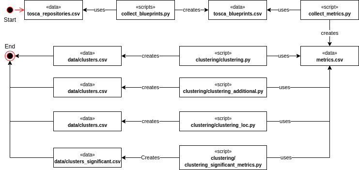

# README

This is the replication package for the paper: **Detecting Technology-Agnostic Infrastructure Code Smells Using Unsupervised Learning: a Case Study on Large Class**.
Below some useful information to replicate the work:

     

## How to reproduce

* Make sure *git* is installed on your machine
* Install dependencies with `pip install -r requirements.txt`
* Run `python clustering.py` for the experiment and to generate **data/clusters.csv** 

## Additional information

* `data/tosca_repositories.csv` is a static file containing the collected TOSCA repositories.
* `data/tosca_blueprints.csv` is generated running `python collect_blueprints.py`. This script collects the raw urls of 
  blueprints in the latest release of every repository. Use this command if you want to collect updated blueprints.   
* `data/metrics.csv` is generated running `python collect_metrics.py`. This script uses the previous csv to access the 
  raw content of every blueprint and extract the metrics used in this study.
* `data/clusters.csv` is generated running `python clustering.py`. This is the only script that has to be run to
  replicate the study. In addition, it shows information about the statistical analysis.
* `data/validation.csv` is a static file containing the validation results among the assessors.  